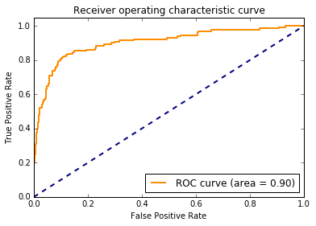
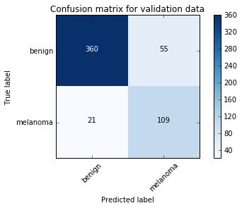

# ISIC_melanoma

This is the repo for blog post <a href='http://yinniyu.github.io/posts/melanoma'>Binary Classifier for Melanoma Using MobileNet</a>. Instead of the previous MobileNet model, DenseNet had better performance and is more robust. The Keras model runs on Tensorflow backend, and the AMI used was Bitfusion Ubuntu 14 TensorFlow with instance type of g2.2xlarge. 

## Training the model
The general workflow is as follows: segmentation of original image(segmentation_01_preprocessing.py, segmentation_02_segnet_train.py) --> mask image(image_mask_array.py) --> train model on masked images(densenet_train.py).

<i>Note: This repo is still a work-in-progress, more information/graphics will be added later. </i>

First, training images of melanoma and seborrheic keratoses are augmented to generate more copies because those categories are under represented. Segmentaion is applied to 'clean up' the image by minimizing the noise and artifacts of the original image. A SegNet model (Fig.1) is trained for this step.

   Fig.1. Schematic of the segnet architecture used in this repo.

 
 
 After the segmentation mask is applied to the image, DenseNet is trained as a 3-class classifier (benign, seborrheic keratoses, and melanoma). The dense connections between the layers within the DenseNet block unit offers the advantage of better information flow, and learning from finer localized features in addition to broader contextual information. 

 
  Fig.2. Schematic of the densenet121 architecture based on Keras' application model.

   
 ## Model Evalution
 
 The model is evaluated using F1 score and AUC metrics based on the melanoma vs. non-melanomic prediction, as show in the ROC curve and confusion matrix below in Fig.3. The test set performance evaluation turned out to be very similar to the validation set.
 

Fig.3. Evaluation of DenseNet model performance.

