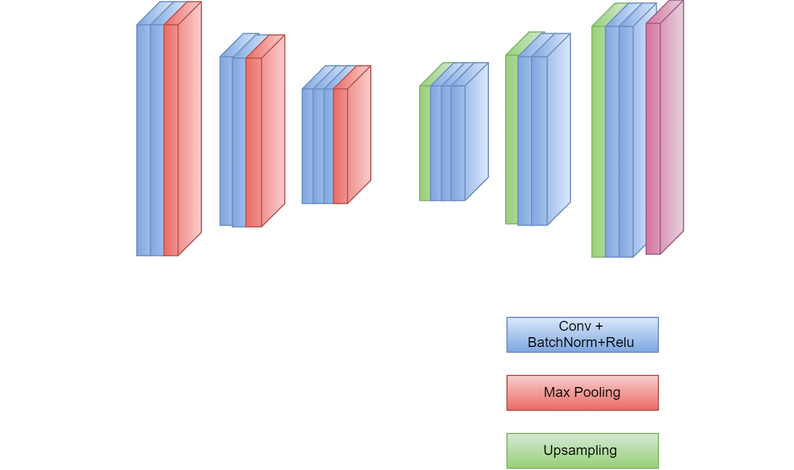
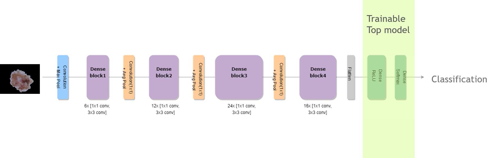

# ISIC_melanoma

This is the repo for blog post <a href='http://yinniyu.github.io/posts/melanoma'>Binary Classifier for Melanoma Using MobileNet</a>. The Keras model runs on Tensorflow backend, and the AMI used was Bitfusion Ubuntu 14 TensorFlow with instance type of g2.2xlarge.

The general workflow is as follows: segmentation of original image --> mask image --> run model on masked image to predict.

<figure>
   
   <figcaption>Fig.1. Schematic of the segnet architecture used in this repo.</figcaption>
</figure> 
   

<figure>
   
   <figcaption>Fig.2. Schematic of the densenet121 architecture based on Keras' application model.</figcaption>
</figure> 
   
   
  
